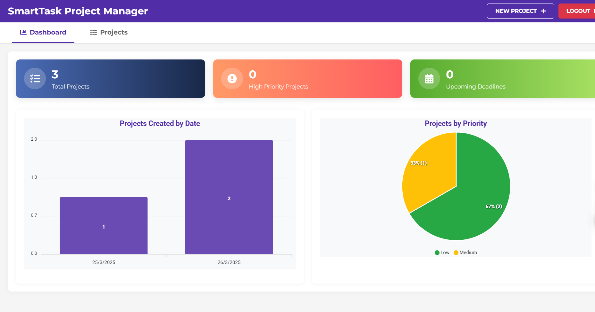

# SmartTask Project Manager - Frontend

[](https://pi2-smarttask-frontend.onrender.com/)

## 📋 Descripción

SmartTask es una aplicación modular de gestión de proyectos y tareas que permite a los usuarios organizar su trabajo de manera eficiente. Esta aplicación está diseñada con una arquitectura modular, separando el frontend, backend y base de datos en servicios independientes, todos desplegados en Render.



## ✨ Características

- **Autenticación de usuarios**: Registro e inicio de sesión seguro
- **Gestión de proyectos**: Crear, leer, actualizar y eliminar proyectos
- **Gestión de tareas**: Organizar tareas por proyecto con estados configurables
- **Panel de control**: Visualización gráfica del estado de los proyectos
- **Diseño responsivo**: Funciona en dispositivos móviles y de escritorio
- **Seguridad**: Autenticación basada en JWT

## 🛠️ Tecnologías

- **React**: Biblioteca para la interfaz de usuario
- **React Router**: Enrutamiento dentro de la aplicación
- **Axios**: Cliente HTTP para comunicación con la API
- **ApexCharts**: Visualización de datos
- **SweetAlert2**: Notificaciones y diálogos mejorados
- **React Icons**: Iconos vectoriales

## 🚀 Instalación y configuración local

1. Clona el repositorio:
   ```bash
   git clone https://github.com/[tu-usuario]/pi2-smarttask-frontend.git
   cd pi2-smarttask-frontend
   ```

2. Instala las dependencias:
   ```bash
   npm install
   ```

3. Configura las variables de entorno:
   - Crea un archivo `.env` en la raíz del proyecto
   - Añade la URL del backend:
     ```
     REACT_APP_API_URL=https://smarttask-backend-tcsj.onrender.com/api
     ```

4. Inicia el servidor de desarrollo:
   ```bash
   npm start
   ```

5. Abre tu navegador en [http://localhost:3000](http://localhost:3000)

## 📁 Estructura del proyecto

```
src/
│
├── api/          # Configuración de Axios y funciones de API
├── assets/       # Imágenes y recursos estáticos
├── components/   # Componentes React reutilizables
│   ├── Dashboard.js       # Visualización de estadísticas
│   ├── LoginRegister.js   # Formularios de autenticación
│   ├── Modal.js           # Componente modal genérico
│   ├── ProjectForm.js     # Formulario de proyectos
│   ├── ProjectList.js     # Lista de proyectos
│   ├── TaskForm.js        # Formulario de tareas
│   ├── TaskList.js        # Lista de tareas
│   └── TaskModal.js       # Modal para gestión de tareas
│
├── images/       # Imágenes para documentación y UI
├── App.js        # Componente principal y enrutamiento
├── index.js      # Punto de entrada
└── ...
```

## 📘 Guía de usuario

### Inicio de sesión y registro

1. Accede a la aplicación en [https://pi2-smarttask-frontend.onrender.com](https://pi2-smarttask-frontend.onrender.com)
2. Si ya tienes una cuenta, introduce tu nombre de usuario y contraseña
3. Si eres un nuevo usuario, haz clic en "Register" para crear una cuenta

### Panel de control

El panel de control te muestra:

- Total de proyectos
- Proyectos de alta prioridad
- Plazos próximos
- Gráfico de proyectos por fecha de creación
- Gráfico de proyectos por prioridad

### Gestión de proyectos

1. Haz clic en la pestaña "Projects" para ver tus proyectos
2. Para crear un nuevo proyecto, haz clic en "NEW PROJECT"
3. Completa el formulario con:
   - Título
   - Descripción
   - Fecha de culminación
   - Prioridad (alta, media, baja)
4. Para editar un proyecto, haz clic en el botón "Edit" en la tarjeta del proyecto
5. Para eliminar un proyecto, haz clic en el botón "Delete"

### Gestión de tareas

1. Para ver las tareas de un proyecto, haz clic en "View Tasks"
2. Para añadir una nueva tarea:
   - Completa el formulario con título, descripción y fecha de vencimiento
   - Selecciona el estado (pendiente, en progreso, completada, cancelada)
   - Haz clic en "Save"
3. Para editar una tarea, haz clic en el botón de edición
4. Para eliminar una tarea, haz clic en el botón de eliminar

### Cierre de sesión

Para cerrar sesión, haz clic en el botón "LOGOUT" en la barra superior.

## 🌐 Acceso a la aplicación

La aplicación está desplegada y accesible en la siguiente URL:

[https://pi2-smarttask-frontend.onrender.com](https://pi2-smarttask-frontend.onrender.com)

## 🔄 Integración con el backend

Este frontend se comunica con una API REST desplegada en:

[https://smarttask-backend-tcsj.onrender.com](https://smarttask-backend-tcsj.onrender.com)

## 📝 Licencia

Este proyecto está bajo la Licencia MIT. Ver el archivo `LICENSE` para más detalles.

## 👨‍💻 Autores

- Juan Sebastian Cifuentes Vallejo - 202179800
- Hernán David Cisneros Vargas - 2178192
- Santiago Duque Chacón - 202180099
- Nicolas Fernando Huertas Cadavid - 202180569
- Miguel Ángel Moreno Romero - 202125737
- Kevin Alejandro Velez Agudelo - 2123281
